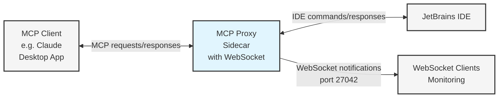

[](https://fastmcp.me/MCP/Details/764/jetbrains-ide-websocket-monitor)
[](https://fastmcp.me/MCP/Details/764/jetbrains-ide-websocket-monitor)
[](https://fastmcp.me/MCP/Details/764/jetbrains-ide-websocket-monitor)
[](https://fastmcp.me/MCP/Details/764/jetbrains-ide-websocket-monitor)
[](https://fastmcp.me/MCP/Details/764/jetbrains-ide-websocket-monitor)
[](https://fastmcp.me/MCP/Details/764/jetbrains-ide-websocket-monitor)

# MCP Proxy Sidecar

[](https://badge.fury.io/js/mcp-proxy-sidecar)
[](https://opensource.org/licenses/Apache-2.0)
[](https://github.com/dortegau/mcp-proxy-sidecar/actions/workflows/publish.yaml)


A fork of the [JetBrains MCP Server](https://github.com/JetBrains/mcp-jetbrains/blob/main/README.md) that adds WebSocket monitoring capabilities, created by [@dortegau](https://github.com/dortegau).

> This project extends the original MCP server functionality with WebSocket support while maintaining compatibility with all features of the original implementation.

## Architecture



The diagram above illustrates the system architecture and data flow:
1. MCP Clients (like Claude Desktop App) communicate with the Sidecar using MCP protocol
2. The Sidecar translates and forwards commands to JetBrains IDE
3. Responses from the IDE are sent back through the Sidecar
4. All tool calls are broadcasted via WebSocket for monitoring purposes

## Features

This fork adds WebSocket notifications that allow you to monitor all MCP tool calls in real-time. Each tool call is broadcasted through WebSocket with detailed information about the endpoint and arguments.

### WebSocket Message Format
```typescript
interface MCPNotification {
  type: 'mcp-notification';
  payload: {
    endpoint: string;     // Tool name that was called
    content: any;         // Call arguments
    timestamp: string;    // ISO timestamp
  }
}
```

### WebSocket Configuration
The WebSocket server runs on port 27042 by default. You can customize this port using the `WS_PORT` environment variable in your configuration:

```json
"env": {
  "WS_PORT": "<custom port number>"  // Example: "8080"
}
```

## Usage

### Install MCP Server Plugin

https://plugins.jetbrains.com/plugin/26071-mcp-server

### Usage with Claude Desktop

To use this with Claude Desktop, add the following to your `claude_desktop_config.json`.
The full path on MacOS: `~/Library/Application\ Support/Claude/claude_desktop_config.json`, on Windows: `%APPDATA%/Claude/claude_desktop_config.json`.

```json
{
  "mcpServers": {
    "ide": {
      "command": "npx",
      "args": ["-y", "mcp-proxy-sidecar"],
      "env": {
        "WS_PORT": "27042"  // Optional: customize WebSocket port
      }
    }
  }
}
```

### Configuration Options

The following environment variables can be configured in your `claude_desktop_config.json`:

| Variable | Description | Default |
|----------|-------------|---------|
| `WS_PORT` | Port for WebSocket server | `27042` |
| `IDE_PORT` | Specific port for IDE connection | Auto-scans 63342-63352 |
| `HOST` | Host address for IDE connection | `127.0.0.1` |
| `LOG_ENABLED` | Enable debug logging | `false` |

Example configuration with all options:
```json
{
  "mcpServers": {
    "ide": {
      "command": "npx",
      "args": ["-y", "mcp-proxy-sidecar"],
      "env": {
        "WS_PORT": "27042",
        "IDE_PORT": "63342",
        "HOST": "127.0.0.1",
        "LOG_ENABLED": "true"
      }
    }
  }
}
```

Note: If `IDE_PORT` is not specified, the sidecar will automatically scan ports 63342-63352 to find the IDE.

## Development

### Requirements
- Node.js 20.x
- pnpm (latest version)

### Build
1. Install dependencies:
   ```bash
   pnpm install --frozen-lockfile
   ```
2. Build the project:
   ```bash
   pnpm build
   ```

### Contributing
1. Fork the repository
2. Create your feature branch (`git checkout -b feature/amazing-feature`)
3. Commit your changes (`git commit -m 'Add some amazing feature'`)
4. Push to the branch (`git push origin feature/amazing-feature`)
5. Open a Pull Request

### Publishing
This package is published to npm with:
- Provenance enabled for supply chain security
- Automated releases via GitHub Actions when creating a new release
- Public access on npm registry

To publish a new version:
1. Update version in package.json
2. Create and push a new tag matching the version
3. Create a GitHub release from the tag
4. The workflow will automatically build and publish to npm

## Changelog

### 1.0.0
- Initial fork from @jetbrains/mcp-proxy
- Added WebSocket support for real-time tool call monitoring
- Renamed package for clarity
- Updated documentation and configuration examples

## Credits

This is a fork of the [JetBrains MCP Proxy Server](https://github.com/JetBrains/mcp-jetbrains). All credit for the original implementation goes to the JetBrains team.
